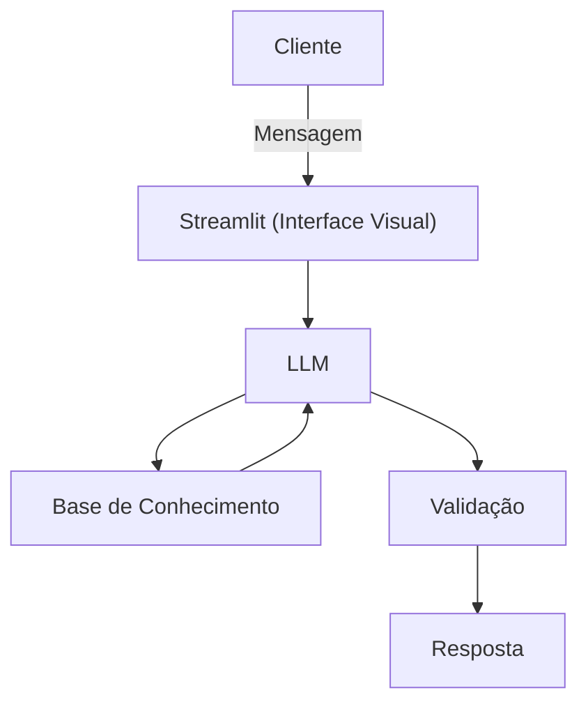

# Documentação do Agente

## Caso de Uso

### Problema
> Qual problema financeiro seu agente resolve?

Muitas pessoas têm dificuldade em controlar seus gastos diários, o que resulta em despesas desnecessárias, falta de planejamento financeiro e, em alguns casos, endividamento. A ausência de alertas inteligentes e de uma visão clara sobre para onde o dinheiro está indo torna o controle financeiro confuso e pouco eficiente.

### Solução
> Como o agente resolve esse problema de forma proativa?

O assistente virtual com Inteligência Artificial atua como um aliado financeiro, monitorando despesas, analisando padrões de consumo e enviando alertas personalizados quando os gastos fogem do planejado. Com uma interface simples e inteligente, ele ajuda o usuário a tomar decisões mais conscientes, promovendo organização financeira e economia no dia a dia.

### Público-Alvo
> Quem vai usar esse agente?

Pessoas que desejam melhorar o controle de suas finanças pessoais, como jovens adultos, trabalhadores autônomos, estudantes e famílias que buscam organizar seus gastos mensais. Também é indicado para usuários que preferem soluções digitais práticas e automatizadas para gestão financeira.

---

## Persona e Tom de Voz

### Nome do Agente
ContaZen

### Personalidade
> Como o agente se comporta? (ex: consultivo, direto, educativo)

- Consultiva
- Proativa e Educativa
- Nunca julga os gastos do Cliente

### Tom de Comunicação
> Formal, informal, técnico, acessível?

O tom de comunicação é acessível, claro e amigável, evitando termos excessivamente técnicos.

### Exemplos de Linguagem
- Saudação: "Olá! Bem-vindo ao ContaZen. Estou aqui para te ajudar a acompanhar seus gastos e manter suas finanças sob controle."
- Confirmação: "Entendi! Vou analisar seus gastos e já te aviso se algo estiver fora do planejado."
- Erro/Limitação: "No momento não tenho dados suficientes para fazer essa análise, mas posso te ajudar a registrar ou revisar seus gastos."

---

## Arquitetura

### Diagrama

### Componentes

| Componente | Descrição |
|------------|-----------|
| Interface | [Streamlit](https://streamlit.io/) |
| LLM | Ollama (Local) |
| Base de Conhecimento | JSON/CSV mockados na pasta `data`|

---

## Segurança e Anti-Alucinação

### Estratégias Adotadas

- [ ] Agente responde apenas com base nos dados fornecidos pelo usuário ou previamente cadastrados
- [ ] Alertas e análises seguem regras financeiras definidas (ex: limite mensal)
- [ ] Quando não possui informação suficiente, o agente informa claramente
- [ ] Não realiza recomendações financeiras complexas sem dados adequados do usuário

### Limitações Declaradas
> O que o agente NÃO faz?

- Não substitui um contador, economista ou consultor financeiro profissional
- Não realiza investimentos, transferências bancárias ou operações financeiras reais
- Não fornece aconselhamento financeiro avançado ou personalizado sem dados completos
- Não acessa contas bancárias sem autorização explícita do usuário
